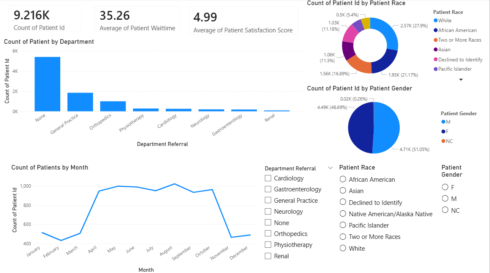

# Hospital Emergency Analysis Dashboard

## Project Overview

This project analyzes hospital patient data using SQL and Power BI.

## Tools Used

* MySQL
* Power BI
* Python (Pandas, NumPy, Matplotlib)

## Dataset

* 9,216 patient records

## Dashboard Preview

## Key Insights

* Average patient wait time: 35.26 minutes
* Average satisfaction score: 4.99
* General Practice received the highest referrals among specialist departments
* Female patients slightly outnumbered male patients
* Admissions peaked during the middle months of the year

## Dashboard Features

* KPI Cards
* Department Analysis
* Gender Distribution
* Race Distribution
* Monthly Admission Trends
* Interactive Slicers

## Repository Structure

* data/ : Dataset
* sql/ : SQL queries used for analysis
* dashboard/ : Power BI dashboard file
* screenshot/ : Dashboard screenshots
